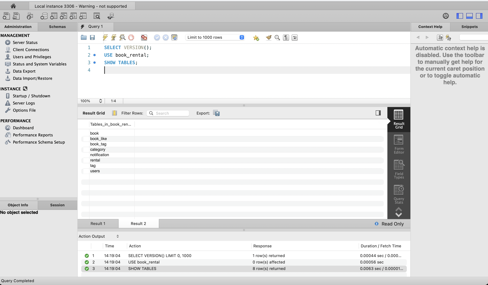
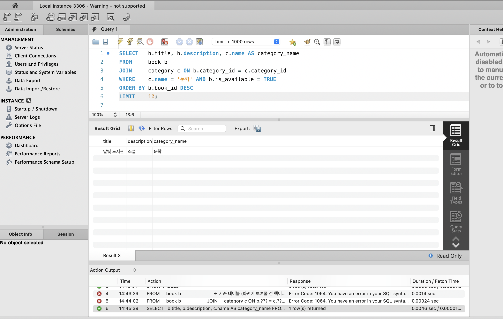
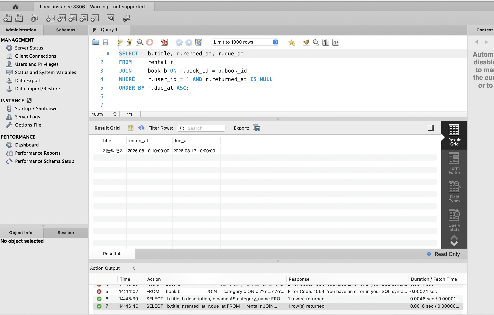
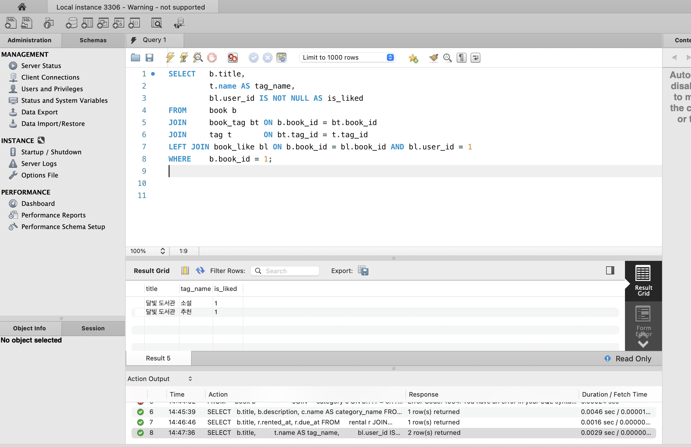
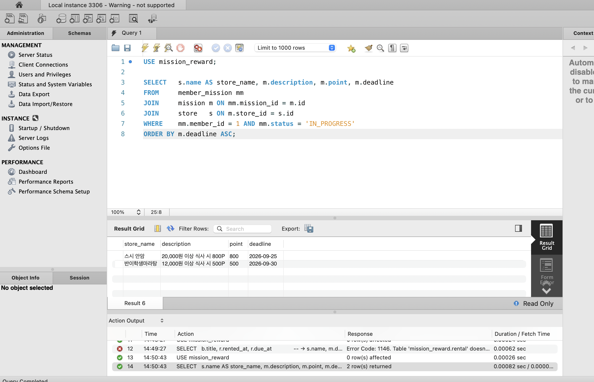

# 2주차 Backend — SQL로 데이터 다루기

온라인 도서 대여 관리 시스템 기준 ERD와 공통 더미 데이터에서 조회 쿼리 3개를 작성하고,
1주차에 설계한 내 ERD(지역별 가게 방문 미션 리워드)로 조회 요구사항 1개를 확장했다.

## 환경

| 항목 | 내용 |
| --- | --- |
| MySQL Server | 26.7.0 (Homebrew `brew install mysql`, `brew services start mysql`) |
| MySQL Workbench | 8.0.47 (Homebrew cask) — 서버 버전이 지원 목록에 없어 "Warning - not supported" 표시, 동작에는 문제 없음 |
| 연결 | 127.0.0.1:3306, root |
| 실습 DB | `book_rental` (기준 ERD), `mission_reward` (내 1주차 ERD) |



## 실행 순서

```bash
mysql -u root < 01_schema.sql        # book_rental DB + 테이블 8개
mysql -u root < 02_seed.sql          # 공통 더미 데이터
mysql -u root < 10_mission1_available_books_by_category.sql
mysql -u root < 11_mission2_my_unreturned_rentals.sql
mysql -u root < 12_mission3_book_tags_and_like.sql

mysql -u root -e "CREATE DATABASE mission_reward;"
mysql -u root mission_reward < ../week1-erd.sql   # 내 1주차 ERD DDL
mysql -u root < 03_my_erd_seed.sql
mysql -u root < 13_extension_my_in_progress_missions.sql
```

## 기준 ERD 관계 (01_schema.sql)

```
users ──1:N── rental ──N:1── book ──N:1── category
users ──N:M── book   (book_like)
book  ──N:M── tag    (book_tag)
users ──1:N── notification
```

## 미션 1. 문학 카테고리 대여 가능 도서 최신순 10개

JOIN 경로: `book ──(category_id)──> category`

```sql
SELECT   b.title, b.description, c.name AS category_name
FROM     book b
JOIN     category c ON b.category_id = c.category_id
WHERE    c.name = '문학' AND b.is_available = TRUE
ORDER BY b.book_id DESC
LIMIT    10;
```

- **기준 테이블** book — 화면에 보여줄 것이 책 목록이므로 book에서 시작한다.
- **JOIN 이유** 카테고리 이름은 category에만 있다. book.category_id(FK) → category.category_id(PK)를 따라가면 책 1권에 카테고리가 정확히 1개 붙는다(N:1).
- **WHERE** 카테고리 이름 '문학', `is_available = TRUE`.
- **정렬·범위** `book_id DESC`(나중에 등록된 책이 위), `LIMIT 10`(첫 페이지).
- **검증** 문학 2권 중 대여 불가인 '겨울의 편지'가 빠지고 '달빛 도서관' 1건만 나와 요구사항과 일치한다.



## 미션 2. 특정 사용자의 미반납 도서, 반납 예정일 순

JOIN 경로: `rental ──(book_id)──> book`

```sql
SELECT   b.title, r.rented_at, r.due_at
FROM     rental r
JOIN     book b ON r.book_id = b.book_id
WHERE    r.user_id = 1 AND r.returned_at IS NULL
ORDER BY r.due_at ASC;
```

- **기준 테이블** rental — 대여 기록 한 행이 곧 화면의 한 줄이다.
- **JOIN 이유** 책 제목은 rental에 없다. rental.book_id(FK) → book.book_id(PK).
- **WHERE** `user_id = 1`(현재 로그인 사용자, API가 없어 고정), `returned_at IS NULL`(미반납). NULL은 `=`로 비교하면 UNKNOWN이 되어 행이 하나도 남지 않으므로 반드시 `IS NULL`을 쓴다.
- **정렬** `due_at ASC` — 반납일이 가까운 것부터. 개인 대여 목록은 짧아 LIMIT 생략.
- **검증** rental 2건 중 수현(user 2)은 반납 완료라 제외, 민서(user 1)의 '겨울의 편지' 1건 → 일치.



## 미션 3. 특정 책의 태그 목록 + 특정 사용자의 좋아요 여부

JOIN 경로: `book ──> book_tag ──> tag` (N:M, 중간 테이블 경유) / `book ──LEFT JOIN──> book_like`

```sql
SELECT    b.title,
          t.name AS tag_name,
          bl.user_id IS NOT NULL AS is_liked
FROM      book b
JOIN      book_tag  bt ON b.book_id  = bt.book_id
JOIN      tag       t  ON bt.tag_id  = t.tag_id
LEFT JOIN book_like bl ON b.book_id  = bl.book_id AND bl.user_id = 1
WHERE     b.book_id = 1;
```

- **기준 테이블** book — 상세 화면의 주인공은 책 한 권.
- **JOIN 이유** book과 tag는 직접 연결이 없어(N:M) book_tag를 거쳐 두 번 JOIN한다. 좋아요는 "없을 수도 있는" 정보라 `LEFT JOIN` — INNER JOIN이면 좋아요를 안 한 경우 책 행 자체가 사라진다.
- **ON vs WHERE** `bl.user_id = 1`을 WHERE에 두면 좋아요를 안 한 경우 `bl.user_id`가 NULL이라 행이 통째로 걸러져 LEFT JOIN의 의미가 없어진다. 그래서 ON 절에 둔다.
- **좋아요 여부** `bl.user_id IS NOT NULL` → 매칭 행이 있으면 1, 없으면 0.
- **검증** 책 1의 태그 소설·추천 2건, 민서(user 1)는 책 1에 좋아요 → `is_liked` 1, 1 → 일치. `user_id = 2`로 바꾸면 행은 2건 그대로, `is_liked`만 0으로 바뀌어 LEFT JOIN이 의도대로 동작함을 확인했다.



## 확장. 내 1주차 ERD — 진행 중인 미션을 마감 임박 순으로

> 요구사항: "로그인한 회원이 진행 중인 미션을 마감 임박 순으로 보여 준다."
> 결과: 가게 이름, 미션 설명, 포인트, 마감일

JOIN 경로: `member_mission ──(mission_id → mission.id)──> mission ──(store_id → store.id)──> store`

```sql
SELECT   s.name AS store_name, m.description, m.point, m.deadline
FROM     member_mission mm
JOIN     mission m ON mm.mission_id = m.id
JOIN     store   s ON m.store_id   = s.id
WHERE    mm.member_id = 1 AND mm.status = 'IN_PROGRESS'
ORDER BY m.deadline ASC;
```

미션 2와 같은 사고 과정을 그대로 적용했다.

| 미션 2 (도서 대여) | 확장 (미션 리워드) |
| --- | --- |
| rental (기준) | member_mission (기준) |
| book | mission → store (JOIN 하나 더) |
| `returned_at IS NULL` | `status = 'IN_PROGRESS'` |
| `due_at` | `deadline` |

- **기준 테이블** member_mission — 회원별 미션 수행 기록 한 행이 화면의 한 줄.
- **JOIN 이유** 미션 설명·포인트·마감일은 mission에, 가게 이름은 store에 있어 두 단계를 따라간다. 내 ERD는 PK가 전부 `id`라 ON 양쪽 컬럼명이 다르다(`mm.mission_id = m.id`).
- **WHERE** `member_id = 1`, `status = 'IN_PROGRESS'`. 1주차에 "상태는 수행 기록(member_mission)에 둔다"고 정한 설계가 여기서 그대로 쓰인다.
- **검증** 회원 1의 수행 3건 중 SUCCESS인 '성수 김밥' 제외, 스시 안암(09-25) → 반이학생마라탕(09-30) 2건 → 일치.



## 쿼리를 쓰면서 확인한 것

- **생각하는 순서 ≠ 쓰는 순서.** 생각은 FROM → JOIN → WHERE → SELECT → ORDER BY → LIMIT 순서로 하지만, SQL은 SELECT를 맨 앞에 쓴다. DB 엔진도 실제로는 FROM부터 처리하기 때문에 SELECT에서 붙인 별칭을 WHERE에서 쓸 수 없다.
- **NULL은 `IS NULL`.** `= NULL`은 에러가 안 나면서 결과만 0건이 되어 원인을 찾기 어렵다.
- **INNER JOIN vs LEFT JOIN.** "반드시 있는" 관계(책→카테고리)는 INNER, "없을 수도 있는" 관계(책→좋아요)는 LEFT. LEFT JOIN의 오른쪽 테이블 조건은 WHERE가 아니라 ON에 둔다.
- **N:M은 JOIN 두 번.** 중간 테이블(book_tag)을 거쳐야 한다.
